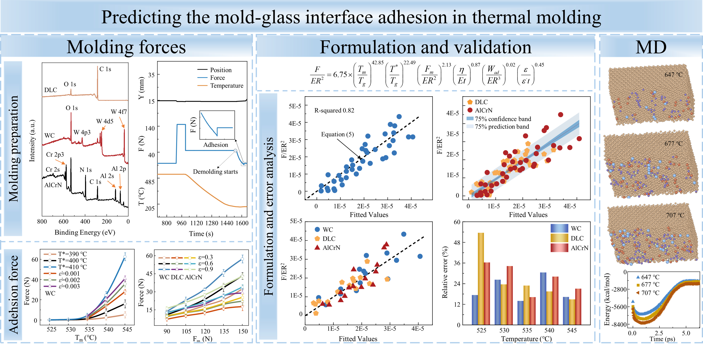
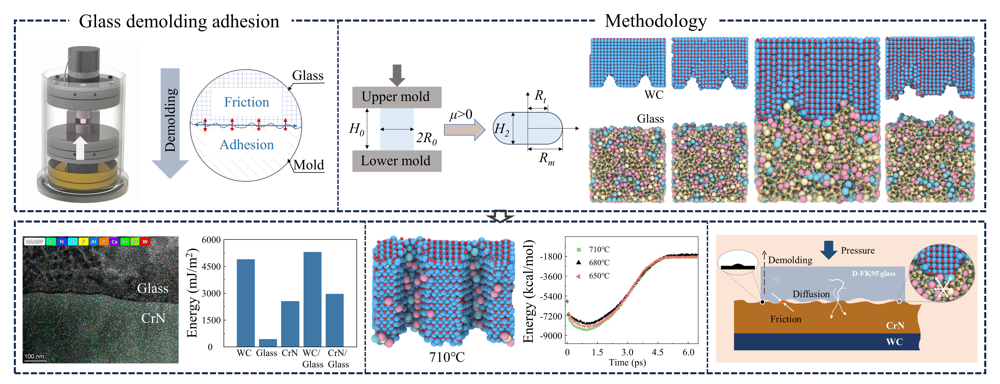








# Welcome! 
I am currently a PhD student at Southern University of Science and Technology, [MAE](https://mae.sustech.edu.cn/), [Institue for Manufacturing Innovation](https://imi.sustech.edu.cn/) with an expected graduation date of July 2025.

From 2021 to 2024, I specialized in Mechanics under the supervision of Professor [Liangchi Zhang](https://www.sustech.edu.cn/en/faculties/zhangliangchi.html), focusing on interface contact in thermal molding for glass. Prior to this, from 2014 to 2021, I completed both my Bachelor’s and Master’s degrees in Materials Engineering at [Nanchang University](https://english.ncu.edu.cn/), where I conducted research on magnesium alloy under the supervision of Professor [Yong Liu](https://www.scopus.com/authid/detail.uri?authorId=57580549700).

My research interests encompass Materials science, Interface adhesion mechanics, Molecular dynamics simulations, and First-principles calculations. Currently, I am actively engaged in projects related to optical lenses for my doctoral research.

You can find my CV here: [Hanhan Zhao’s Curriculum Vitae](../assets/cv_Hanhanzhao.pdf). If you are interested in my work, please feel free to drop me an [email](mailto:12131127@mail.sustech.edu.cn).

# 🔥 News
- *2024.11*: New Paper on Mold-Glass Interface Adhesion Mechanisms in Thermal Molding, Invited Review (In preparation)
- *2024.09*: New Paper on Predicting the Mold-Glass Interface Adhesion in Thermal Molding, International Journal of Mechanics Science (Under Review)
- *2024.08*: New Paper on Assessment of CrN/WC Molds: Surface Adhesion in Glass Molding, WEAR (Under Review)
- *2023.12*:  &nbsp;🎉🎉 New Paper on Evaluating the Demolding Adhesion in Glass Molding, accepted by The 25th International Symposium on Advances in Abrasive Technology
- *2023.07*:  &nbsp;🎉🎉 New Paper on Wear of Mold Surfaces: Interfacial Adhesion in Glass Molding, WEAR 204847, 524-525, 2023

# 📝 Publications 
* During My Doctoral Research Program

WEAR 2023

[Wear of Mold Surfaces: Interfacial Adhesion in Glass Molding](https://www.sciencedirect.com/science/article/pii/S0043164823002302)

**Hanhan Zhao**, Asit Kumar Gain, Zhen Li, Liangchi Zhang

**SCI TOP Journal Paper** <strong></strong>
- vol. 524-525, pp. 204847, 2023, doi:
  https://doi.org/10.1016/j.wear.2023.204847. 

IJMS 2024

Predicting the Mold-Glass Interface Adhesion in Thermal Molding

**Hanhan Zhao**, Liangchi Zhang

**SCI TOP Journal Paper** <strong></strong>

WEAR 2025

Assessment of CrN/WC Molds: Surface Adhesion in Precision Glass Molding

**Hanhan Zhao**, Liangchi Zhang

**SCI TOP Journal Paper** <strong></strong>

# 🎖 Honors and Awards
- *2024.01* 2022-2023 Outstanding Graduate Student of Southern University of Science and Technology (Top 1%)
- *2023.12* II Edition 'Star of the School of Engineering' Award at Southern University of Science and Technology (Top 5%)
- *2022.09* 2022 Outstanding Graduate Teaching Assistant of Southern University of Science and Technology (Top 5%)
- *2020.05* 202 Second-class Graduate Academic Scholarship of Nanchang University, 2019-2020 Academic Year (Top 30%)
- *2016.04* 2022 First-class Undergraduate Scholarship of Nanchang University, 2015-2016 Academic Year (Top 5%)

# 📖 Educations
- *2021.09 - 2024.10 (now)*, PhD of Mechanics, Southern University of Science and Technology, Shenzhen, China
     - Supervised by Prof. Liangchi Zhang
- *2018.09 - 2021.06*, Master of Materials Engineering, Nanchang University, Nanchang, China
     - Supervised by Prof. Yong Liu
- *2014.09 - 2018.06*, Bachelor of Materials Engineering, Nanchang University, Nanchang, China
     - Supervised by Prof. Yong Liu

# 💬 Invited Talks
- *2023.04*, Oral presentation, 24th International Conference on Wear of Materials WOM 2023, Banff (Canada).

  <i>Let my soul's truth mirror the honesty I show the world.</i>

